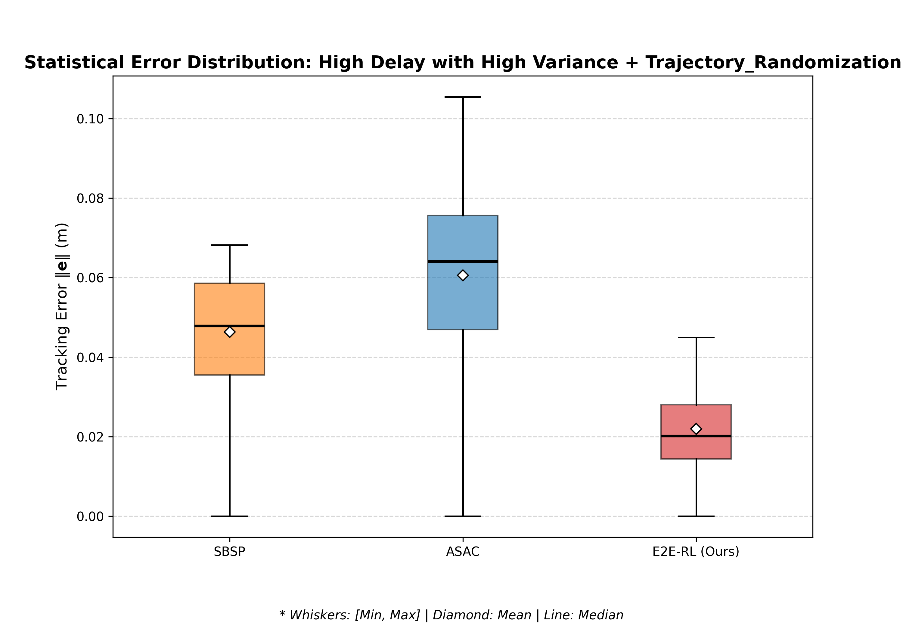

# End-to-End Reinforcement Learning for Robust Teleoperation under Stochastic Delays

This repository contains the implementation, simulation environment, and experimental results of the Master's Thesis **"End-to-End Reinforcement Learning for Robust Teleoperation under Stochastic Delays"** conducted at the **Technical University of Munich (TUM)** *Munich Institute of Robotics and Machine Intelligence (MIRMI)*.

## Overview
This repository contains the implementation, simulation environment, and experimental results of the Master's Thesis **"End-to-End Reinforcement Learning for Robust Teleoperation under Stochastic Delays"** conducted at **TUM MIRMI**.

Unlike traditional **Two-Stage** approaches that decouple state prediction from control, this framework jointly optimizes a **Delay-Adaptive LSTM Encoder** and a **Soft Actor-Critic (SAC)** policy. By explicitly conditioning on the instantaneous delay magnitude and outputting direct torque commands, the system eliminates the performance ceiling caused by cascaded error propagation.

**Author:** **Kai-Ze Deng** (M.Sc. Robotics, Cognition and Intelligence)  
**Supervisor:** **Dr. Zewen Yang** (MIRMI, TUM)

---

## Key Features

| Feature | Description |
| :--- | :--- |
| **Delay-Adaptive Prediction** | LSTM encoder conditions on explicit delay magnitude ($\overline{d}_s$) to dynamically adjust prediction horizons. |
| **Autoregressive Rollout** | Maintains physically consistent state estimates at 1 kHz, even during extended packet loss (jitter). |
| **Direct Torque Control** | E2E policy bypasses PD gains, learning implicit compensation for gravity, friction, and prediction errors. |
| **Sim-to-Real Ready** | Built on ROS 2 Humble with a modular architecture for seamless deployment on Franka Panda robots. |

---
## Problem Statement

Networked teleoperation faces three critical challenges under stochastic latency (90–290 ms):

1.  **Delay-Invariant Failure:** Standard RL policies optimize for "average" delay, failing to adapt to sudden latency spikes.
2.  **Discontinuous Estimation:** Existing predictors (e.g., PMDC/SBSP) act as "zero-order holds" between packets, causing control oscillation.
3.  **Cascaded Error Propagation:** Separating prediction from control means the controller blindly tracks erroneous predictions.

## Results

We evaluated the framework against state-of-the-art baselines on a 7-DoF Franka Panda.

### Quantitative Comparison (Mean Tracking Error)
| Scenario | PMDC (Baseline) | ASAC (Model-Free) | **E2E-RL (Ours)** | Improvement |
| :--- | :---: | :---: | :---: | :---: |
| **Low Delay** (170-210ms) | 0.033 m | 0.061 m | **0.022 m** | **+33%** |
| **High Jitter** (90-290ms) | 0.040 m | 0.076 m | **0.025 m** | **+37%** |
| **Randomized Trajectory** | 0.046 m | 0.059 m | **0.022 m** | **+52%** |

### Visual Performance (High Jitter)
The proposed method (Red) maintains stability while baselines oscillate.


*Figure 1: Time-series tracking error under 90-290ms stochastic delay.*


*Figure 2: Error distribution under randomized trajectories.*

## Repository Structure

The repository tracks the progressive development of the solution, containing the baselines and the final proposed framework.

## Repository Structure

The repository is organized as a ROS 2 workspace (`libfranka_ws`). Each major framework is contained within its own package, following a modular structure (Config, Nodes, Utils, and Core Algorithms).

```text
libfranka_ws/
├── src/
│   ├── E2E_Teleoperation/                 # [Proposed Method] Novel End-to-End LSTM-based Policy
│   │   ├── config/                        # Hyperparameter configurations
│   │   ├── E2E_RL/                        # Core Reinforcement Learning implementation
│   │   │   ├── sac_policy_network.py      # Network architecture (Actor-Critic + LSTM)
│   │   │   ├── sac_training_algorithm.py  # SAC algorithm logic
│   │   │   ├── training_env.py            # Gymnasium environment wrapper
│   │   │   ├── train_agent.py             # Main training entry point
│   │   │   ├── local_robot_simulator.py   # Leader robot physics/simulation
│   │   │   └── remote_robot_simulator.py  # Follower robot physics/simulation
│   │   ├── nodes/                         # ROS 2 Nodes for deployment
│   │   └── utils/                         # Shared utilities (delay simulator, IK solver)
│   │
│   ├── Model_Based_RL_Teleoperation/      # [Previous Iteration] Dynamics-aware LSTM + residual RL framework
│   │
│   ├── Hierarchical_RL_Teleoperation/     # [Previous Iteration] Multi-level RL architecture
│   │
│   ├── SBSP/                              # [Baseline] SOTA Model-Based RL Framework
│   │
│   ├── ASAC/                              # [Baseline] SOTA Model-Free RL Framework
│   │
│   ├── mujoco_ros_pkgs/                   # [Simulation] MuJoCo physics engine interface for ROS2
│   │
│   └── multipanda_ros2/                   # [Simulation] Franka Panda robot descriptions & scenes
│   |                                      # (Adapted from: [github.com/tenfoldpaper/multipanda_ros2]
```

## Installation and Usage
### Prerequisites
* Operating System: Ubuntu 22.04 (Jammy)
* ROS 2 Humble
* Python: 3.10+

### Install Python Libraries
```bash
pip3 install -r requirements.txt
```

### Install Simulation Environment (Multipanda)
Please follow the official installation guide from the Multipanda repository:
[https://github.com/tenfoldpaper/multipanda_ros2](https://github.com/tenfoldpaper/multipanda_ros2)

Ensure thay you can launch the default simulation scene before proceeding:
```bash
ros2 launch multipanda_bringup multipanda.launch.py
```

### Setup this repository
```bash
cd ~/libfranka_ws

# Install dependencies
rosdep install --from-paths src --ignore-src -r -y

# Build workspace
colcon build

source install/setup.bash
```
